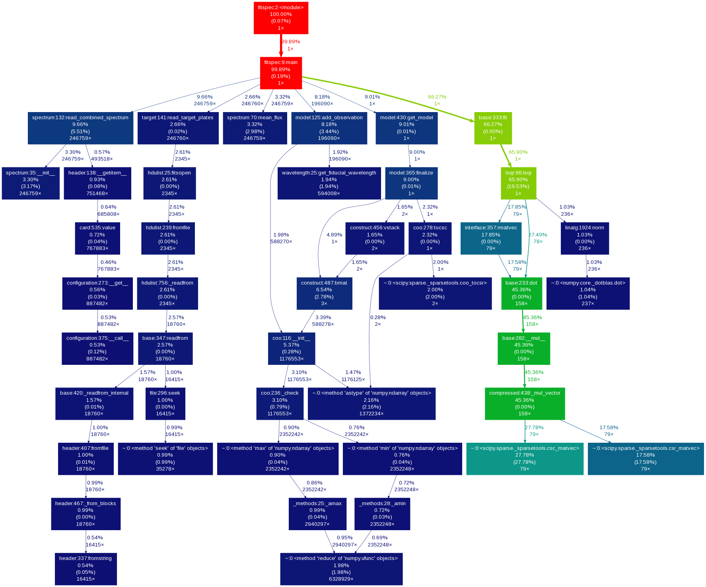

Developement
============

.. contents::

Documentation
-------------

Build
~~~~~

Requires sphinx extensions to build:

.. code-block:: bash

    $ pip install sphinx_bootstrap_theme
    $ pip install sphinxcontrib-napoleon
    $ pip install sphinxcontrib-programoutput

Build instructions:

.. code-block:: bash

    $ cd docs
    $ make html
    $ open _build/html/index.html

Initial setup
~~~~~~~~~~~~~

.. code-block:: bash

    $ mkdir docs
    $ cd docs
    $ sphinx-quickstart

Edit config.py and specify sys.path to top level:

.. code-block:: python

    sys.path.insert(0, os.path.abspath('..'))

.. code-block:: bash

    $ sphinx-apidoc -o src ../qusp --separate

Profiling
---------

Run program w/ profiler:

.. code-block:: bash

    $ python -m cProfile -o profile.out <program> <args>

View stats in interactive session:

.. code-block:: python

    import pstats
    p = pstats.Stats('profile.out')
    p.sort_stats('time').print_stats(10)

Create a call tree diagram:

.. code-block:: bash

    $ gprof2dot -f pstats profile.out | dot -Tpng -o profile.png

Might need to install ``gprof2dot``:

.. code-block:: bash

    $ pip install gprof2dot

Here is an example call tree diagram:

Code Style Guide
----------------

Run pylint to help keep everything nice and pretty.

.. code-block:: bash

    $ pylint qusp/*.py --reports=no --extension-pkg-whitelist=numpy

The ``pylintrc`` file in the toplevel directory specifies configuration options. For example,
we ignore ``bad-continuation`` and extend the character limit per line.

Here is a quick find ``,([^\s])`` and replace ``, \1`` regex pattern for adding spaces after commas.

Data transfers
--------------

Copy spPlates from darkmatter to hpc:

.. code-block:: bash

    $ rsync -avz --prune-empty-dirs --include '*/' --include 'spPlate*.fits' --exclude '*' -e ssh dmargala@darkmatter.ps.uci.edu:/data/boss/v5_7_0 /share/dm/all/data/boss/

Copy spAll from darkmatter to hpc:

.. code-block:: bash

    $ scp dmargala@darkmatter.ps.uci.edu:/data/boss/spAll-v5_7_0.fits /share/dm/all/data/boss/

Create target list from lists of plates:

.. code-block:: bash

    for plate in $(cat ~/blue-plates.txt); \
    do \
    examples/filter.py -i /share/dm/all/data/boss/spAll-v5_7_0.fits \
        --select "(['plate'] == $plate) & (['objtype'] == 'QSO') & (['zwarning'] == 0) & (['z'] > .5)" \
        --save systematics/$plate.txt --annotate 'ra:dec:z' --verbose; \
    done

Environment Setup
-----------------

HPC
~~~

Only tested using interactive session so far...

::

    qrsh -q dm

Use a local user install of anaconda for python.

::

    module purge
    export PATH=/data/users/dmargala/anaconda/bin:$PATH
    export PYTHONPATH=/data/users/dmargala/source/qusp

    export BOSS_ROOT=/share/dm/all/data/boss
    export BOSS_VERSION=v5_7_0

Darkmatter
~~~~~~~~~~

::

    export PYTHONPATH=/home/dmargala/source/qusp

    export BOSS_ROOT=/data/boss
    export BOSS_VERSION=v5_7_0
